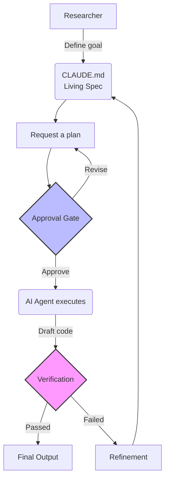

::::::::::::::::::::::::::::::::::::::: objectives

## Objectives

- Describe what different AI tools can see and what they can change.
- Compare chatbot, IDE assistant, CLI agent, and fully agentic workflows.
- Create a Living Spec (CLAUDE.md) to guide an agent.
- Explain why you remain the active reviewer of AI-generated code.

::::::::::::::::::::::::::::::::::::::::::::::::::

:::::::::::::::::::::::::::::::::::::::: questions

- What can each kind of AI tool see, and what can it change?
- Why use a CLI for AI instead of a browser?
- What is the Living Spec and why does it matter?

::::::::::::::::::::::::::::::::::::::::::::::::::

::::::::::::::::::::::::::::::::::::::::: instructor

## Setup check

Ask all learners to run:

```bash
claude --version
```

If it returns a version number, they are ready. If the command is not found, they need to complete the install and sign in (launch `claude` once and follow the prompts) before continuing. Confirm everyone has selected the same model with `/model`.

::::::::::::::::::::::::::::::::::::::::::::::::::

## Why CLI matters for research

Most researchers use chat-based AI in a browser. These tools are good for brainstorming but run in an isolated sandbox. They cannot see your files, run your code, or understand your project structure without manual uploads.

A CLI (Command Line Interface) agent runs in your terminal, the same place you run Python scripts or navigate your filesystem with `ls` and `cd`, and has access to three things a browser tool does not.

**Your files and data.** The agent can read your actual datasets, inspect your directory structure, and write scripts directly to disk. You are not copying and pasting between a chat window and a code editor. The agent works in your project the way a collaborator sitting at your machine would.

**Your installed tools.** Your machine probably has domain-specific software on it: geospatial tools like GDAL, bioinformatics pipelines, R packages, custom scripts, institutional data connectors. A browser AI has no idea these exist. A CLI agent can call them directly, pass output between them, and build on what you already have installed.

**An iterative loop.** When a script fails, the agent sees the error output in the terminal and can try again. You are not copying stack traces back into a chat window. The feedback loop is tight and stays in one place.

## What the tool can see, and what it can change

Before you trust any AI tool, the first question is always: *what can it see, and what can it do?* The more access a tool has, the more it can help, and the more it can quietly get wrong. These four kinds of tools sit along that spectrum.

| Tool type | What context it has | What it can do | What can go wrong | What a novice should verify |
|---|---|---|---|---|
| **Chatbot** (browser, e.g., ChatGPT, Gemini web) | Only what you paste in | Suggests code and text | No view of your real files; guesses at structure; you copy code by hand | That the code matches your *actual* columns and files, not the example it imagined |
| **IDE assistant** (e.g., Copilot in VS Code) | The file you have open, sometimes nearby files | Suggests and inserts code inline | Sees only part of the project; may complete code that fits the line but not the goal | That the suggestion does what you intended, not only what looks plausible |
| **CLI agent** (e.g., Claude Code, Codex CLI) | Your project directory: files, data, structure | Reads files, runs code, writes scripts to disk | Can edit or delete real files; can act on a misread of your data | What files it read, what it changed, and what it ran, before you approve |
| **Fully agentic workflow** (multi-step, runs tools on its own) | Whatever you grant, across many steps | Plans and executes a chain of actions with little input | Errors compound across steps; hard to see where it went wrong | That you can still explain each step and reproduce the result |

As you move down the table, the tool can do more for you and more *to* you. Nothing in this table removes your responsibility to understand the result.

::::::::::::::::::::::::::::::::::::::::: instructor

## Instructor note: access is not understanding

Learners are often impressed that a CLI agent can read their files and run their code. Impressive access is not the same as a correct result. Watch for learners who can describe what the agent *can do* but not what it *just did*.

Before any learner approves a command that changes files, ask them to say out loud: what did the agent read, what is it about to change, and why. If they cannot answer, that is the moment to slow down, not speed up.

::::::::::::::::::::::::::::::::::::::::::::::::::

::::::::::::::::::::::::::::::::::::::::: caution

## Data privacy and institutional context

Your institution decides which AI tools are approved for which kinds of data, and the free tools are usually not the ones you can point at sensitive research data. At UCLA, the centrally provided free tools (Gemini Basic, Microsoft Copilot, ChatGPT web) are web-only and approved for data classified P1-P3, with P4 requiring approval. None of them is a terminal agent. See [UCLA's available AI tools list](https://dts.ucla.edu/initiatives/ai/available-tools).

For the terminal workflow in this lesson, think in two paths:

- **Personal plan or API key** for non-sensitive (P1-P3) work. Simple to set up; this is what most workshop exercises assume. Do not use it with sensitive or restricted data.
- **UCLA Amazon Bedrock** (Anthropic models) for sensitive (P3/P4) research data. Claude Code can run against Bedrock with the same commands; only the backend changes. Confirm your unit's access and data-tier approval first.

**Warning:** Personal accounts often lack the privacy protections of an institutional agreement. Consult your campus data policy before using any AI tool with sensitive data. PHI and attorney-client privileged information are not approved for these tools.

**Looking ahead:** If your research requires fully local processing, these same skills transfer to open-weight models (like Gemma or Llama) run via Ollama.

::::::::::::::::::::::::::::::::::::::::::::::::::

## From writer to active reviewer

People sometimes describe this shift as moving from "writer" to "orchestrator," as if the AI now does the work and you just conduct. That framing is misleading, and for a learner it is risky.

A more honest version: **AI may reduce the need to recall every detail of syntax, but it increases the need to understand intent, dependencies, assumptions, tests, and failure modes.** You are not handing off the thinking. You are moving the work from typing towards reading, questioning, and judging. That is harder to do well, not easier.

You guide the agent using a **Living Spec**, and then you review what it produces against that spec. The diagram below shows the loop: you define the goal, the agent proposes a plan, *you* approve before any code is written, and *you* verify the result before it counts as done.



::::::::::::::::::::::::::::::::::::::::: instructor

## Discussion prompt
Ask learners: "Have you ever used ChatGPT to write code that looked correct but failed when you ran it?"
This is a good time to introduce the concept of orchestration. The goal is not only to "fix" code, but to ensure the AI's *intent* (the spec) is correct.

::::::::::::::::::::::::::::::::::::::::::::::::::

This introduces a new challenge: **verification load**. You must coordinate and validate the agent's actions against your requirements.

::::::::::::::::::::::::::::::::::::::::: callout

## Managing cognitive load

It is common to feel "out of the loop" when the AI generates many lines of code quickly. To manage this, focus on anchoring your understanding. Read the comments the AI generates and test small pieces of code frequently. If a block of logic is confusing, ask the AI to explain it before moving on.

::::::::::::::::::::::::::::::::::::::::::::::::::

## File system access

Unlike browser tools, Claude Code has access to your working environment. It can read project context from the directory structure and modify files. Instead of copying and pasting code, the agent writes scripts to your disk and can iterate based on terminal errors.

::::::::::::::::::::::::::::::::::::::::: caution

## Security responsibility

Giving an AI agent access to your filesystem is a security responsibility. A buggy or misconfigured agent could delete files or access sensitive data, such as passwords.

Always consider that your tools can have unintended consequences. Ensure files are backed up or under version control (like Git) so you can revert unwanted changes.

::::::::::::::::::::::::::::::::::::::::::::::::::

### Long context

Like humans, we only have a certain amount of working memory, and large language models (LLMs) operate in a similar way. This is called the **context window** in LLM tools. Current models like Claude have long context windows (hundreds of thousands of tokens, up to a million in some configurations). You can provide the AI with your entire project folder, scripts, documentation, and small datasets, at once.

This allows you to describe the desired state of your project, and the agent coordinates changes across multiple files. In a research context, this is declarative programming with AI agents.

::::::::::::::::::::::::::::::::::::::::: callout

## A large context window is not a free pass

The more you load into a session, the more the model has to track. Beyond a certain point, quality degrades, the model may lose track of earlier instructions, produce inconsistent output, or fixate on the wrong files. This is sometimes called context poisoning.

A large context window makes this easier to run into, not harder. Managing what goes into your context is part of the workflow, not an afterthought.

::::::::::::::::::::::::::::::::::::::::::::::::::

## Let's make sure this works

Open a terminal window and type `claude --help`. You should see a usage summary listing the options and slash commands available. Claude Code defaults to an interactive session; the `-p` (or `--print`) flag runs a single prompt non-interactively (headless mode), which we use for quick one-off checks.

Navigate to the project folder you created during setup and run a quick headless check:

```bash
cd agentic-research-project
claude -p "Tell me what operating system I am currently using and list the files in this directory."
```

Compare the output to what you see when you run `ls` (or `dir` on Windows). Did the AI accurately describe your environment?

The AI should return a response similar to:

```
You are currently using macOS (Darwin). The files in this directory are:
- index.md
- config.yaml
- episodes/
- data/
...
```

Notice that Claude Code can 'see' your files and understands what environment you are working in. 

We have a project folder that we want to start a project in, let's initialize it for Claude Code and see what that does. 

::::::::::::::::::::::::::::::::::::::::: callout

## Working directory matters

Always start Claude Code from inside your project folder. The agent uses the current directory to find your files and spec. Starting from the wrong folder, such as your home directory, is one of the most common sources of confusion in a workshop.

::::::::::::::::::::::::::::::::::::::::::::::::::


### Initialize your project

Claude Code includes an `/init` command that creates a `CLAUDE.md` file describing your project in your working directory:

```bash
claude
```
You are now inside a Claude Code session. Type `/` to see the available slash commands and page through the full list. Notice `/init`, this is the command that will initialize our project. Let's run it:

```bash
/init
```

Notice that it inspects your files and folders. After it finishes, let's see what new files have been created. You can run a shell command from inside the session by starting the line with `!`:

```bash
!ls
```

This shows the files that are present. You should see a file named `CLAUDE.md`. Let's look inside it:

```bash
!cat CLAUDE.md
```

Here is the kind of thing Claude Code generates for a fresh, nearly empty project folder:

```markdown
# CLAUDE.md

## Project Overview

This directory is a workspace for the `agentic-research-project` project. It is
currently nearly empty, so there is little structure to describe yet. This
file provides project context for Claude Code and is intended to be updated
as the project evolves.

## Key Files

- **`CLAUDE.md`**: Project-specific context, conventions, and rules that
  Claude Code loads automatically at the start of every session.

## Usage

As you add data files, scripts, and documentation, re-run `/init` to produce
a richer description, and edit this file by hand to record your goals,
constraints, and rules.
```

A few things to notice. Claude Code scanned the directory and described what it found. Because the folder was nearly empty, it does not have much to say yet.
Once you add data files, scripts, and documentation, running `/init` again will produce a richer spec that reflects your actual project.
This is also something you will want to edit by hand, add your goals, constraints, and any rules you want the agent to follow.

## The Living Spec

To get the most out of a CLI agent, provide it with persistent context about your project. This acts as a "Living Spec", a set of rules 
and goals the agent must follow across every session.

Every major CLI tool has its own **native** spec file that it loads automatically when you start a session:

| Tool | Native spec file | Auto-loaded? |
|---|---|---|
| Claude Code | `CLAUDE.md` | Yes |
| OpenAI Codex | `AGENTS.md` | Yes |
| Cursor | `.cursorrules` | Yes |

You can also use a **portable** spec file, `AGENTS.md` is a common convention, that you explicitly reference in any prompt: `"Read AGENTS.md and then..."`. It is not auto-loaded by any single tool, but it travels with your project if you switch tools. AGENTS.md was standardised in 2025 by the Agentic AI Foundation under the Linux Foundation, co-founded by Anthropic, OpenAI, and Block, making it the emerging cross-tool portable spec format.

### What to include in your spec file

Use this file to define:

- **Current Goal**: What you are working on right now.
- **Rules of the Road**: Technical constraints (e.g., "Always use `pandas` for dataframes").
- **Verification Gates**: How you will confirm the code is correct.

::::::::::::::::::::::::::::::::::::::::: callout

## Your project's external brain

A model forgets everything between sessions, and even within a session its context window is limited. The fix researchers have settled on is to keep the project's memory in plain markdown files that the agent reads and updates. Andrej Karpathy popularized calling this an "external brain." Three files do most of the work:

- `CLAUDE.md`: durable rules, goals, and constraints, auto-loaded every session (the file you just created).
- `PLAN.md`: the step-by-step plan for the task at hand. It is temporary, and you will meet it in the next episode.
- A running notes file (for example `NOTES.md`): a dated log of what was tried, what worked, and why you made key choices.

For research, that notes file is not bureaucracy. It is provenance: it is how you, a reviewer, or future-you reconstruct what the agent knew and why a result came out the way it did. Because the external brain lives in your repo and under version control, it stays reviewable and reproducible, unlike the model's hidden and disposable memory.

::::::::::::::::::::::::::::::::::::::::::::::::::

::::::::::::::::::::::::::::::::::::::::: challenge

## Challenge: Initialize and customize your spec file

Inside your Claude Code session, run `/init` to create a `CLAUDE.md` file. Then open it in a text editor and add one "Hard Constraint" (something the AI *must* do) and one "Success Metric" (how you know it's done).

:::::::::::::::::::::::::::::::::::::::: solution

## Example spec file

```markdown
# Project: Arctic Sea Ice Analysis

## Goal
To analyse trends in sea ice extent from 1980-2020.

## Rules of the Road
- **Hard Constraint**: Only use the `xarray` library for spatial data processing.
- **Success Metric**: All final plots must include a valid DOI reference for the data source.

## Conventions
- Use snake_case for variable names.
- Save all plots to the `figures/` directory.
```

::::::::::::::::::::::::::::::::::::::::::::::::::

::::::::::::::::::::::::::::::::::::::::::::::::::

:::::::::::::::::::::::::::::::::::::::::: discussion

## Feedback checkpoint: describe the agent's context

Before we move on, turn to the person next to you and answer out loud: when you ran `/init`, what did the agent look at, and what file did it create? If you are not sure, say so. In the shared Etherpad, paste one thing the agent did that surprised you.

::::::::::::::::::::::::::::::::::::::::::::::::::

:::::::::::::::::::::::::::::::::::::::: keypoints

- Different AI tools see and change different things; always ask what a tool can see and do before trusting it.
- A CLI agent can read, run, and edit your real files, which makes verifying what it changed part of the workflow.
- Run `/init` inside Claude Code to create a `CLAUDE.md` Living Spec that reduces context drift.
- A portable `AGENTS.md` lets the same spec travel across different AI tools.
- The shift is from writing syntax to actively reviewing intent, assumptions, and evidence; it does not remove your responsibility.

::::::::::::::::::::::::::::::::::::::::::::::::::
